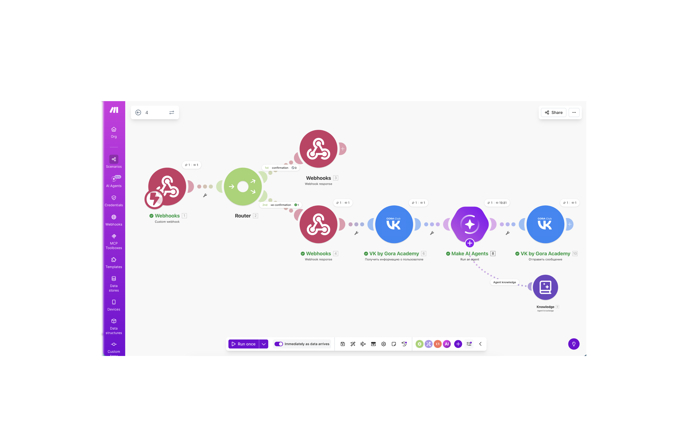
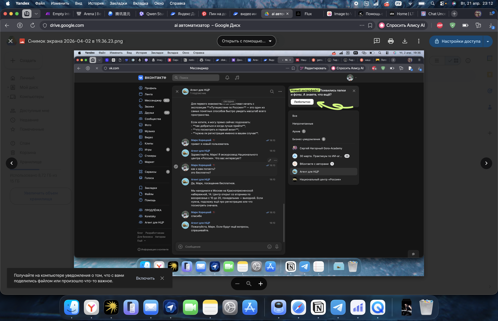
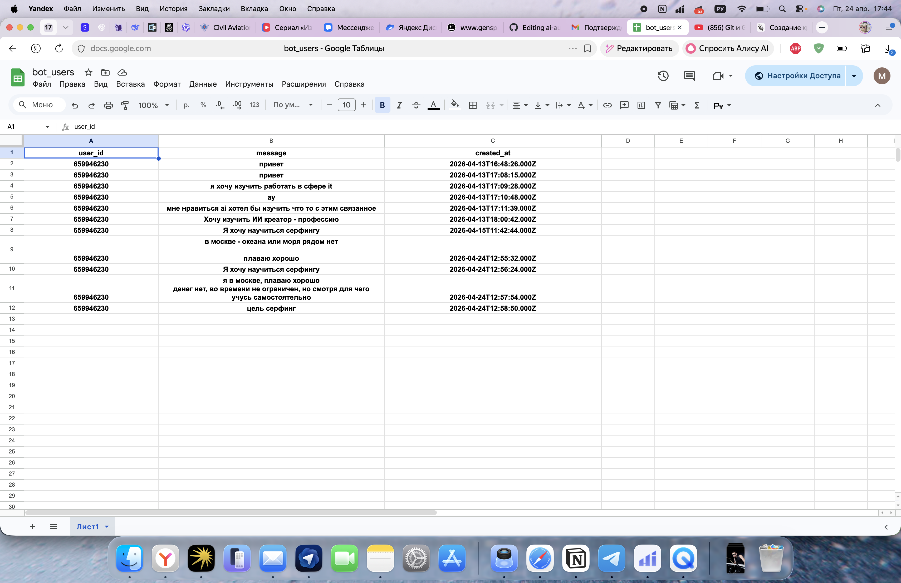
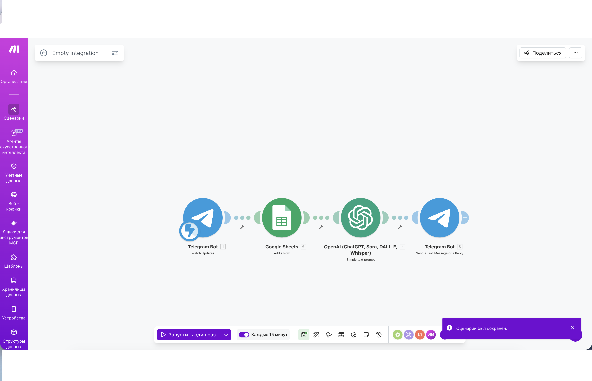

# AI Automation Cases

Репозиторий с кейсами по автоматизации бизнес-процессов и AI-интеграции без кода.

## О себе

Junior AI Integration Specialist. 3 года управления командами 20+ человек (НЦР, ВДНХ). Закончил высшее IT-образование (МФЮА) и среднее специальное по цифровой обработке информации (Щёлковский колледж). Перехожу в AI-автоматизацию через no-code инструменты. Прошёл 2 практикума AGORA ACADEMY (автоматизация + AI-контент).

## Образование

- **МФЮА** — Информационные технологии и применение в бизнесе (высшее, закончено)
- **Щёлковский колледж** — Мастер цифровой обработки информации (среднее специальное)
- **AGORA ACADEMY** — «Автоматизация бизнеса и создание AI-агентов» (апрель 2026, 6 уроков + 4 работы)
- **AGORA ACADEMY** — «Создание AI-контента» (апрель 2026, 6 уроков + 4 работы)

## Кейсы

### 1. AI-агент для VK (Make.com + VK API)
**Задача:** Автоматические ответы пользователям сообщества VK на основе базы знаний с официального сайта.

**Сценарий:**
- Webhooks → Router → VK API → Make AI Agents + Knowledge Base

**Результат:**
- 100% типовых запросов обрабатываются автоматически
- Время ответа: с 2 часов до мгновенного
- Работа с бесплатной нейросетью (лимитированные кредиты)

### 2. Telegram-бот «Навигатор» — личный AI-ассистент (Make.com + OpenAI + Google Sheets)
**Задача:** Структурировать хаос в план. Помощник для продуктивности: принимает «мусор» из мыслей → задаёт уточняющие вопросы → выдаёт конкретный план действий с учётом рабочего графика 3/3.

**Сценарий:**
- Telegram Bot (Watch Updates) → Google Sheets (Add a Row) → OpenAI (ChatGPT) → Telegram Bot (Send Message)

**Как работает:**
1. Пишу боту хаотичные мысли («хочу выйти на удалёнку к зиме, не знаю с чего начать»)
2. Бот сохраняет запрос в Google Sheets (база всех обращений)
3. OpenAI обрабатывает контекст + рабочий график
4. Бот возвращает: уточняющие вопросы → структурированный план → шаги на сегодня/неделю

**База данных в Google Sheets:**

**Статус:** MVP (апрель 2026). Работает базовый цикл. В планах:
- Подключение персонального графика работы 3/3 для точного планирования
- Доработка промптов для более естественного диалога
- Расширение Google Sheets: цели, дедлайны, приоритеты, история паттернов

---

## Инструменты

- **No-code:** Make.com, n8n
- **AI:** ChatGPT, DeepSeek, Make AI Agents, OpenAI API
- **API:** VK API, Telegram Bot API, Webhooks
- **Продуктовые:** Notion, Google Sheets

## Контакты

- Telegram: @Mariik0
- Email: Markkartofelfree@gmail.com 
- Портфолио: https://www.notion.so/AI-Integration-Specialist-34dceaf4906780e78773c76948a5892b?source=copy_link 
